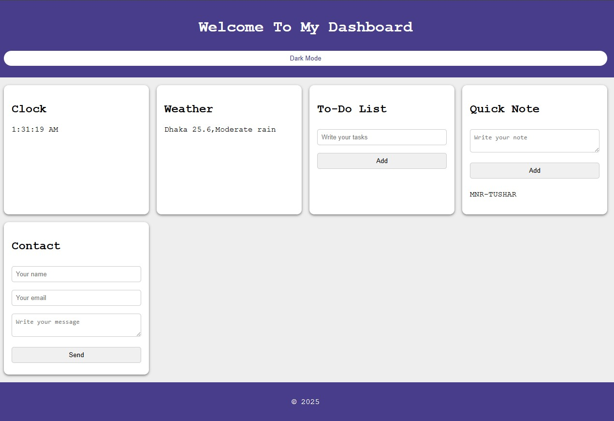

# 🌟 Personal Dashboard

A clean, minimal, and customizable **Personal Dashboard** built using **HTML, CSS, and JavaScript**. It helps you stay organized, focused, and productive — all from your browser!

## 🚀 Live Demo

🔗 [Click here to view the live dashboard](https://mnr-tushar.github.io/Personal-Dashboard/)

---

## ✨ Features

- 🕒 **Real-time Clock** – Stay updated with the current time.
- 🌙 **Dark Mode Toggle** – Switch between light and dark themes.
- ✅ **To-Do List** – Add, complete, and delete your daily tasks.
- 📝 **Quick Notes** – Jot down short notes instantly.
- 🌦️ **Weather Widget** – *(Coming soon: connect to real-time weather API)*.
- 📬 **Contact Form** – A form to send messages or feedback.

---

## 📸 Screenshots

  
*(Add your own screenshot in the repo named `screenshot.png` for display)*

---

## 📁 Technologies Used

- **HTML5**
- **CSS3**
- **JavaScript (Vanilla JS)**

---

## 💡 Future Improvements

- 🌐 Integrate a working weather API (like OpenWeatherMap).
- 🔔 Add notification/reminder system.
- 🎨 Theme customization (backgrounds, fonts, etc.).
- 📱 Make the dashboard fully responsive for mobile devices.

---

## 🛠️ Setup & Usage

You can simply clone the repository and open `index.html` in any modern browser.

```bash
git clone https://github.com/MNR-Tushar/Personal-Dashboard.git
cd Personal-Dashboard
open index.html
